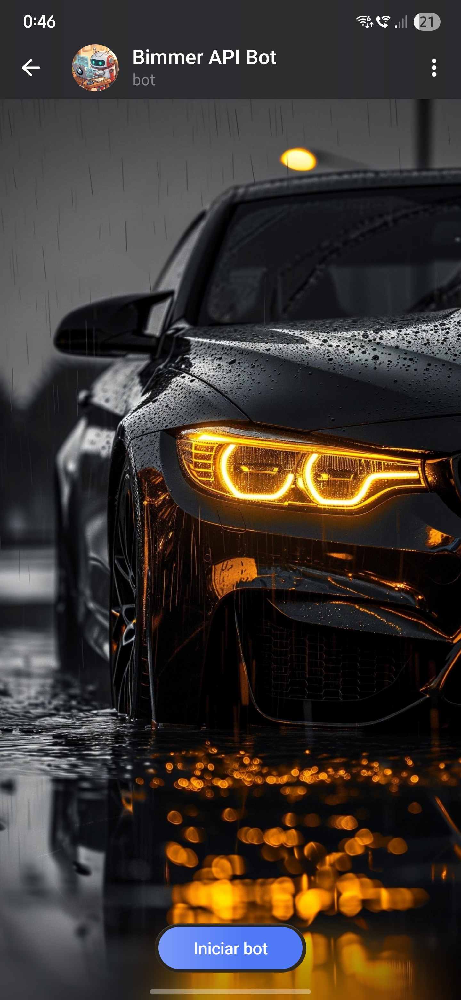
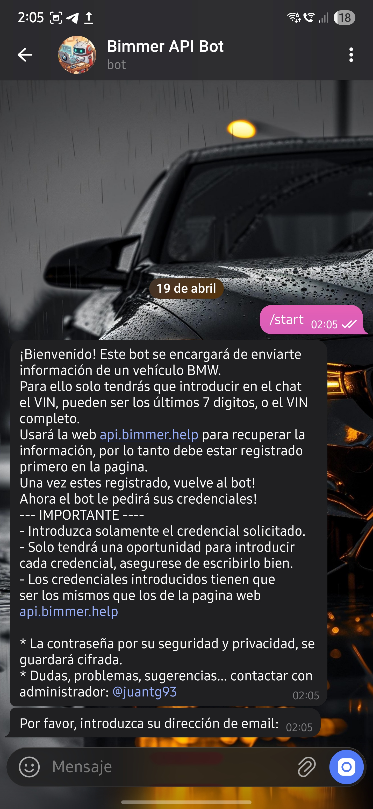
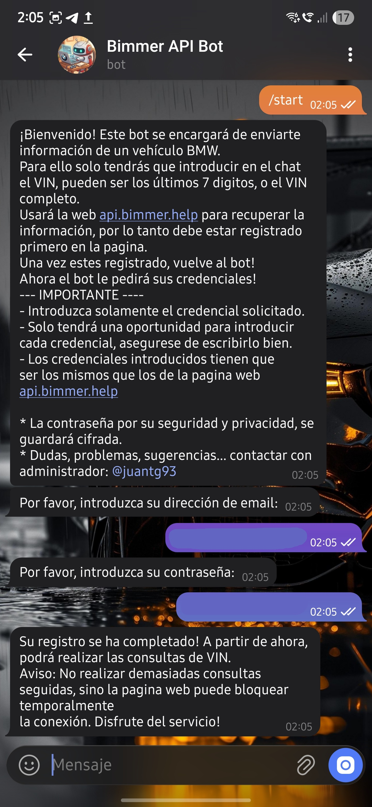
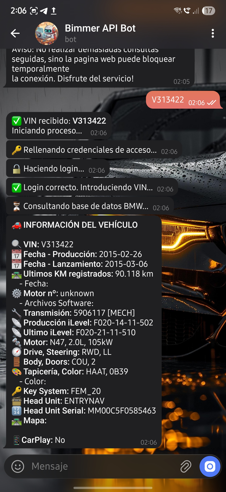

# 🚗 Bimmer API Bot
 
Un bot de Telegram que te devuelve información detallada de cualquier vehículo BMW a partir de su número VIN.  
Consulta producción, motor, transmisión, head unit, compatibilidad con CarPlay y mucho más desde tu móvil, en segundos.
 
---
 
## 📖 ¿Qué hace el bot?
 
Envías el VIN de un BMW al chat y el bot te devuelve una ficha completa del vehículo con:
 
- 📅 **Fecha de producción** y **fecha de lanzamiento**
- 🛣️ **Últimos kilómetros registrados**
- ⚙️ **Motor** (número, tipo, cilindrada, potencia)
- 🔧 **Transmisión**
- 📡 **iLevel** (producción y última versión conocida)
- 🧭 **Drive / Steering** (tracción y dirección)
- 🚪 **Body / Doors** (carrocería y número de puertas)
- 🎨 **Tapicería y color**
- 🔑 **Key System**
- 📻 **Head Unit** + número de serie
- 📱 **Compatibilidad con CarPlay** calculada automáticamente según el head unit
---
 
## 🚀 Cómo empezar
 
### 1. Regístrate en api.bimmer.help
 
El bot necesita una cuenta en [api.bimmer.help](https://api.bimmer.help) para poder consultar los vehículos en tu nombre.  
Entra en la web y crea tu cuenta primero. **Este paso es obligatorio.**
 
### 2. Inicia el bot en Telegram
 
Busca el bot en Telegram y pulsa el botón **"Iniciar bot"**.
 

  

### 3. Completa el registro
 
El bot te dará la bienvenida y te pedirá tu email y tu contraseña de api.bimmer.help.  
**Introdúcelos en dos mensajes separados**, tal y como te los pida.
 

  

Una vez guardadas tus credenciales, el bot te confirmará que ya puedes empezar.
 

  

### 4. Consulta cualquier VIN
 
Envía el VIN al chat. Puede ser el **VIN completo (17 caracteres)** o los **últimos 7 dígitos**.  
El bot te irá mostrando el progreso y en unos segundos recibirás toda la información del vehículo.
 

  

---
 
## ⚠️ Información importante antes de usar
 
- 🔐 **Tu contraseña se guarda cifrada** con cifrado Fernet. Nadie, ni siquiera el administrador, puede leerla en texto plano.
- ✉️ **Solo tendrás una oportunidad** para introducir cada credencial durante el registro. Asegúrate de escribirlas bien.
- 🕑 **No hagas consultas seguidas sin pausa.** La web api.bimmer.help puede bloquear temporalmente tu cuenta si detecta demasiadas peticiones en poco tiempo.
- 🔑 **Las credenciales deben coincidir exactamente** con las que usas en api.bimmer.help. Si cambias tu contraseña en la web, también tendrás que actualizarla en el bot.
---
 
## ❓ Preguntas frecuentes
 
### Ya me había registrado y eliminé el chat del bot. ¿Tengo que volver a registrarme?
 
No. El bot recuerda tu cuenta aunque elimines el chat. Cuando vuelvas a iniciarlo, te avisará de que **ya estás registrado** y podrás usar el bot directamente sin tener que volver a introducir tus credenciales.
 
### ¿Qué formatos de VIN acepta?
 
El bot acepta tanto el VIN completo (17 caracteres) como los últimos 7 dígitos. Si envías una longitud distinta, el bot te avisará.
 
### ¿Mi contraseña está a salvo?
 
Sí. Se guarda cifrada en la base de datos con cifrado Fernet. El bot la descifra únicamente en el momento de hacer login en api.bimmer.help y no se almacena en ningún log.
 
### ¿Por qué me sale "CarPlay: No"?
 
El bot comprueba automáticamente la compatibilidad de tu vehículo con Apple CarPlay basándose en el modelo del head unit. No todos los head units de BMW son compatibles.
 
### ¿Cuánta información me da el bot?
 
Exactamente la misma que obtendrías consultando manualmente tu VIN en api.bimmer.help, pero en formato resumido y directamente en Telegram, sin necesidad de abrir el navegador.
 
---
 
## 💬 Soporte
 
¿Dudas, problemas o sugerencias? Contacta con el administrador en Telegram: [@juantg93](https://t.me/juantg93)
 
---
 
## 📌 Estado del proyecto
 
Proyecto personal de código abierto. Actualmente funcional y en uso.  
Se siguen añadiendo mejoras periódicamente.
 
---
 

  <i>Hecho con ☕ y pasión por los BMW</i>

 